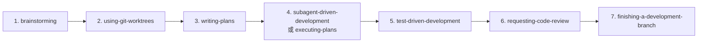

# obra/superpowers 仓库深度分析

> **仓库**: https://github.com/obra/superpowers  
> **作者**: Jesse Vincent (Prime Radiant)  
> **Stars**: 132k ⭐ | **Forks**: 11k | **版本**: v5.0.7 (2026-03-31)  
> **License**: MIT  
> **Languages**: Shell 58.8% | JavaScript 29.6% | HTML 4.3% | Python 3.7% | TypeScript 2.8%

---

## 1. 一句话总结

Superpowers 是一个 **面向 AI 编码代理的技能框架 + 软件开发方法论**，通过可组合的 "skills" 将零散的 agent 行为编排成一条端到端的纪律化开发流水线：**头脑风暴 → 设计审批 → 实现计划 → 子代理驱动开发 → TDD → Code Review → 分支收尾**。

---

## 2. 核心理念（哲学）

| 原则 | 含义 |
|------|------|
| **Test-Driven Development** | 先写测试，始终先写测试 |
| **Systematic over ad-hoc** | 流程优于猜测 |
| **Complexity reduction** | 简单性是首要目标 |
| **Evidence over claims** | 验证先于宣称成功 |
| **YAGNI + DRY** | 贯穿所有计划和实现 |

---

## 3. 架构概览

### 3.1 目录结构
```
superpowers/
├── .claude-plugin/          # Claude Code 插件配置
├── .cursor-plugin/          # Cursor 插件配置
├── .codex/                  # Codex 安装指南
├── .opencode/               # OpenCode 安装指南
├── agents/                  # Agent 配置
├── commands/                # CLI 命令
├── hooks/                   # 生命周期钩子
├── scripts/                 # 辅助脚本
├── skills/                  # ⭐ 核心技能集（14 个）
├── tests/                   # 测试
├── docs/                    # 文档
├── CLAUDE.md                # Claude Code 指令（PR 贡献规范）
├── GEMINI.md                # Gemini CLI 指令（引用 skills）
├── AGENTS.md                # OpenAI Codex 指令（→ CLAUDE.md）
├── package.json             # NPM 包
└── gemini-extension.json    # Gemini 扩展描述
```

### 3.2 多平台适配
Superpowers 是 **零依赖** 的插件，支持 6 个平台：

| 平台 | 安装方式 |
|------|---------|
| Claude Code | `/plugin install superpowers@claude-plugins-official` |
| Cursor | `/add-plugin superpowers` |
| Codex | 提示 agent 读取 INSTALL.md |
| OpenCode | 提示 agent 读取 INSTALL.md |
| GitHub Copilot CLI | `copilot plugin install` |
| Gemini CLI | `gemini extensions install` |

---

## 4. 14 个技能详解

### 4.1 完整工作流（7 步顺序链）



### 4.2 技能分类

#### 🧠 协作与规划
| 技能 | 触发时机 | 核心行为 |
|------|---------|---------|
| **brainstorming** | 任何创造性工作之前 | 苏格拉底式对话 → 一次一个问题 → 提出 2-3 方案 → 分段展示设计 → 写 design doc → 自审 → 用户审批 |
| **writing-plans** | 设计审批后 | 拆分为 2-5 分钟粒度任务 → 每步含完整代码 → 精确文件路径 → 测试命令 → 预期输出 → 自审 |
| **dispatching-parallel-agents** | 多个独立任务 | 并发子代理工作流 |

#### ⚙️ 执行
| 技能 | 触发时机 | 核心行为 |
|------|---------|---------|
| **subagent-driven-development** | 有实现计划 + 任务独立 | 每个任务派发新子代理 → 两阶段审查（规格合规 → 代码质量）→ 模型分级选择 |
| **executing-plans** | 有实现计划 + 并行会话 | 批量执行 + 人类检查点 |
| **using-git-worktrees** | 设计审批后 | 创建隔离工作区 → 新分支 → 验证测试基线 |
| **finishing-a-development-branch** | 所有任务完成 | 验证测试 → 提供选项（merge/PR/keep/discard）→ 清理 worktree |

#### 🧪 质量保障
| 技能 | 触发时机 | 核心行为 |
|------|---------|---------|
| **test-driven-development** | 任何实现工作 | **铁律: 没有失败测试就没有生产代码** → RED-GREEN-REFACTOR → 先写测试看它失败 → 写最少代码通过 → 重构 |
| **systematic-debugging** | 任何 bug/测试失败 | **铁律: 不找根因不修 bug** → 4 阶段流程（根因调查 → 模式分析 → 假设测试 → 实现修复）|
| **verification-before-completion** | 修复后 | 确保真的修好了 |
| **requesting-code-review** | 任务间 | 按严重性报告问题，Critical 阻断进度 |
| **receiving-code-review** | 收到反馈时 | 系统化处理反馈 |

#### 🔧 元技能
| 技能 | 用途 |
|------|-----|
| **using-superpowers** | 技能系统入口 → 强制检查技能 → **1% 可能性就必须调用** |
| **writing-skills** | 创建新技能的最佳实践 |

---

## 5. 关键设计模式深度分析

### 5.1 using-superpowers: 强制纪律的心理学设计

这是整个框架的 **行为根** —— 它不是教 agent 怎么做事，而是教 agent **不要跳过流程**。

**Red Flags 表**（反合理化设计）:
| Agent 的想法 | 框架的纠正 |
|-------------|-----------|
| "这只是个简单问题" | 问题也是任务，检查技能 |
| "让我先做这一件事" | 做任何事之前先检查 |
| "这个技能太大材小用了" | 简单的事会变复杂，用它 |
| "我记得这个技能" | 技能会更新，读当前版本 |

> **设计洞察**: Superpowers 意识到 AI agent 最大的问题不是能力不足，而是 **过度自信地跳过流程**。整个框架是一套**反合理化系统**。

### 5.2 subagent-driven-development: 工业级子代理编排

这是框架最复杂的技能，包含：

1. **隔离上下文**: 每个任务一个新子代理，避免上下文污染
2. **两阶段审查**: 先审规格合规，再审代码质量（顺序不可逆）
3. **模型分级选择**:
   - 机械任务（1-2 文件）→ 廉价模型
   - 集成任务（多文件）→ 标准模型
   - 架构/设计/审查 → 最强模型
4. **4 种状态处理**: DONE / DONE_WITH_CONCERNS / NEEDS_CONTEXT / BLOCKED
5. **Prompt 模板**: implementer-prompt.md / spec-reviewer-prompt.md / code-quality-reviewer-prompt.md

### 5.3 TDD 的"铁律"执法

```
NO PRODUCTION CODE WITHOUT A FAILING TEST FIRST
```

**极端措施**: 如果先写了代码再写测试 → **删掉代码，从头来**。不是"参考"，不是"适配"，不是"看一眼"。Delete means delete.

**10 条合理化借口清单**: 每个 agent 可能想出的"跳过 TDD"的理由都被预先列出并反驳。

### 5.4 brainstorming: 用户审批门的多层控制

```
HARD-GATE: 设计通过之前禁止任何实现行为
Anti-Pattern 检测: "这太简单不需要设计" → 全部都需要
Visual Companion: 浏览器可视化辅助（需用户同意）
Spec Self-Review: 写完自审（placeholder/矛盾/模糊/范围）
User Review Gate: 用户审批后才能进入 writing-plans
```

---

## 6. 与我们 Orchestrator 的对比

| 维度 | Superpowers | 我们的 Orchestrator |
|------|-----------|-------------------|
| **核心模型** | Skills 链（被动触发） | 状态机（主动驱动） |
| **Agent 分工** | 同一 agent 戴不同"帽子" | 明确 Agent 角色（PM/FE/BE/QA） |
| **子代理** | Claude 子代理 per task | 独立 CLI 进程（codex/gemini） |
| **审批门** | 内嵌在技能流程中 | state.json + 显式 transition |
| **TDD 强制** | 铁律 + 反合理化表 | 由 QA Agent 控制 |
| **文档** | 自动写 design-doc + plan | PRD + design-spec + product-doc |
| **平台** | 6 平台（Claude/Cursor/Codex/OpenCode/Copilot/Gemini） | 自建（Claude+Codex+Gemini） |
| **社区** | 132k stars, 28 贡献者 | 内部使用 |

### 可借鉴的设计
1. **反合理化表 (Red Flags)**: 将 agent 常见的偷懒借口预先列出并反驳 — 可引入我们的 skill 定义
2. **2-5 分钟粒度任务拆分**: 比我们当前的任务粒度更细，适合子代理独立执行
3. **两阶段审查（规格合规 → 代码质量）**: 我们目前只有一轮 QA，可拆分
4. **模型分级选择**: 机械任务用廉价模型，值得在 orchestrator 中实现
5. **Visual Companion**: brainstorming 阶段的浏览器可视化辅助

---

## 7. CLAUDE.md 的 PR 防线

Superpowers 有 **94% 的 PR 拒绝率**。CLAUDE.md 中专门写了一整套"防 AI slop"规则：

- 搜索已有 PR（开放 + 已关闭）
- 确认是真问题（不是 agent 自己发明的）
- 域相关技能不属于核心
- 零第三方依赖
- 每次一个问题
- 禁止批量投 PR
- 禁止虚构内容
- 技能修改需要 eval 证据

> **这对我们的启示**: 当开放社区贡献时，需要类似的 AI 生成内容过滤机制。

---

## 8. 总结

Superpowers 的核心创新不在于技术（它几乎是纯文本指令），而在于 **行为设计**：

1. **强制纪律** — 让 agent 遵守流程而非跳过流程
2. **反合理化** — 预见 agent 的偷懒借口并提前堵住
3. **粒度控制** — 2-5 分钟粒度的任务让子代理不偏离
4. **两阶段质量门** — 规格合规和代码质量分开审查
5. **平台无关** — 同一套技能在 6 个平台运行

它是一个 **"纪律化 AI 编码"的参考实现**，用纯 Markdown 文件实现了对 AI agent 行为的深度塑造。

---

*分析时间: 2026-04-03*
